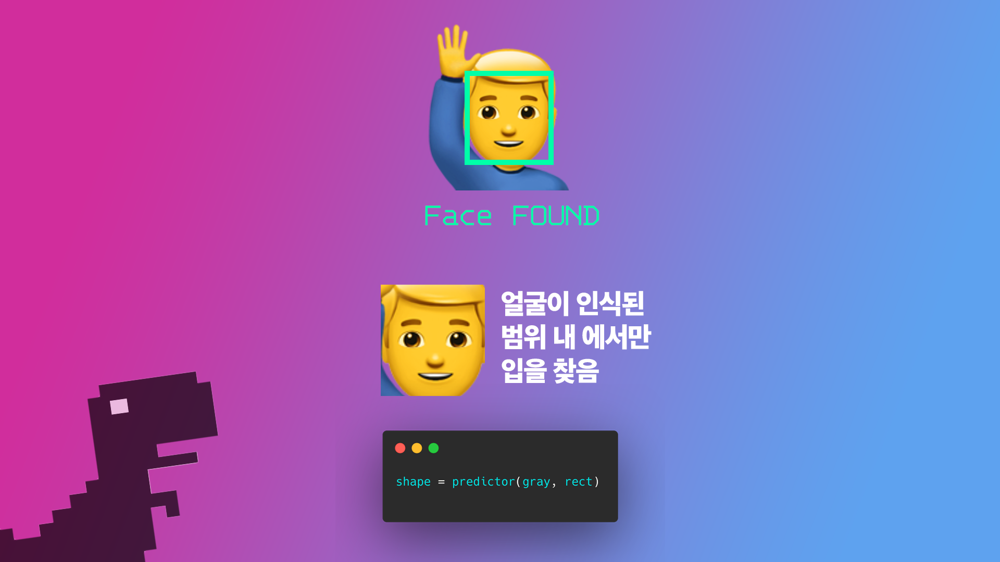
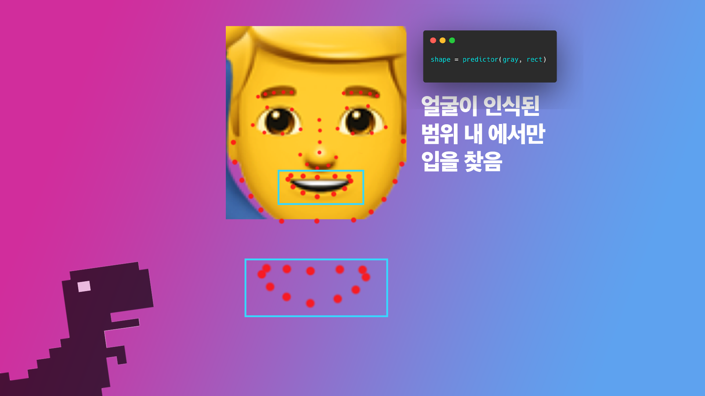
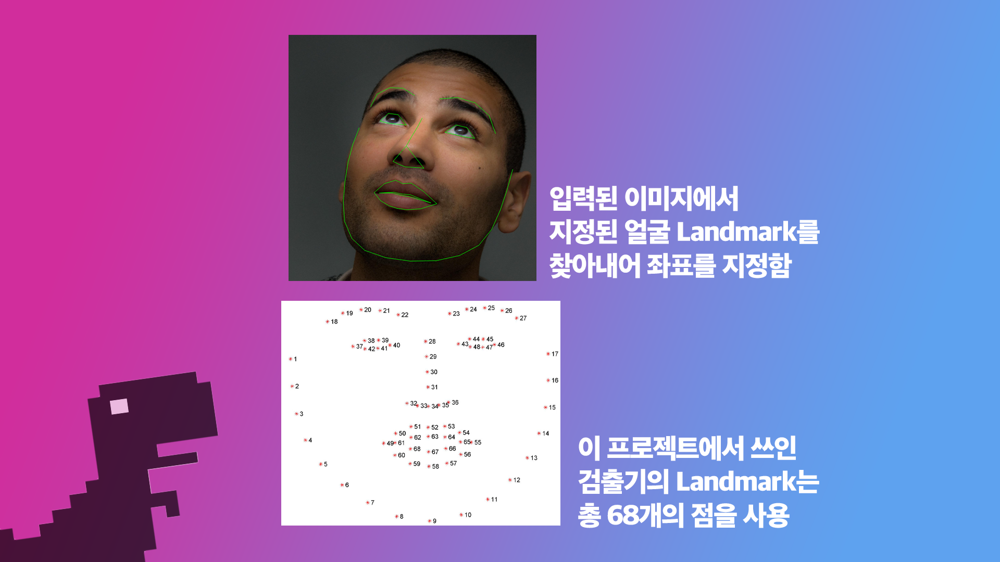
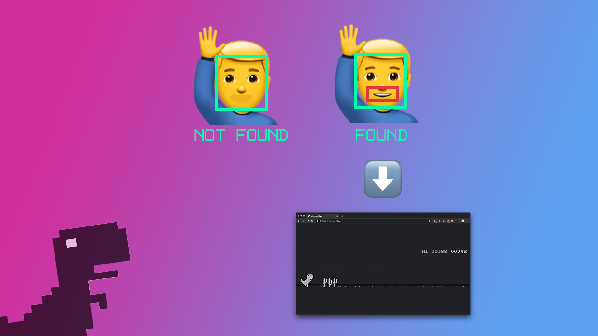

# #아가리벌려_공룡_뛴다
누가 요즘에 아직도 <a href="chrome://dino"> 공룡 게임 </a>을 손으로 하냐? 입으로 하는게 기본 아니야? 

# 설명 좀 해봐요
<h2>Why did you do that?</h2>
시연회를 너무나도 하고 싶었던 네퓨즈 부우장 박인성은 자신의 주 분야인시각처리활용한 시연회 아이디어를 찾던 도중에 openCV를 활용하여 공룡게임을진행한 사람들영상을 보게 되었습니다. 
<a href="https://www.youtubecom/watch?v=eoUOkV5vVpU">(영상 링크)</a> 이를 본 네퓨즈 부우장 박인성은손으로 하는 게임이 아닌 입으로 하는게 좀 재미있지 않을까 라는 생각을 하게됩니다. 이를 계기로 2주간 제작에 몰두하게 됩니다.
        
<h2>What did you do?</h2>        
그럼 openCV 짧게나마 소개를 해야겠죠? openCV는 <i><b>"Open Computer Vision의 약자로 인텔에서 실시간 이미지 프로세싱을 중점으로 둔라이브러리이다."</b></i> 라고 합니다. 이 프로젝트에서 openCV가 쓰인 이유는사람의 입을 찾기 위한 용도입니다. 사람의 입을 찾기 위해서는 openCV에서 쓰이는알고리즘이 있는데요, 바로 <a href="https://ibug.doc.ic.ac.ukresources/facial-point-annotations/">Facial landmark</a> 와 <ahref="#">Haar Cascade</a> 입니다. 아래 그림을 통해 좀 더 자세한 설명을하겠습니다. 가장 먼저 쓰이는 알고리즘은 <i>Haar Cascade</i> 알고리즘입니다. 간단한설명을 하자면 Positive Image (사람 얼굴의 사진)와 Negative Image(사람의 얼굴이 아닌 사진)을 다단계 함수를 통해서 훈련하는 기계 학습 방식의검출기입니다. Positive Image를 통해서 사람의 얼굴이라는 것을 학습을 시키고검출기가 좀 더 정확한 판단을 위해서 Negative Image 학습을 합니다. 비교를통해서 좀 정밀한 결과 값을 얻어내기 위함입니다. <strike style="font-size:x-small;">약간 비싼 음식 먹다가 싼 거 먹으면 확실히 맛없다는 거 느끼는 방식</strike>  

여기서 Haar Cascade 알고리즘을 쓰이는 이유는 입을 찾을 때 오류를 줄이기위함입니다. openCV 에서 사람의 입을 찾는 과정에서 사람의 얼굴이 아닌 부분을검사할수도 있습니다. 사람의 입을 찾을 때 화면 픽셀 전체를 검사하는 것보다 사람의얼굴 픽셀만 검사하는 게 빠르기도 합니다.        여기서부터 <i>Facial Landmark</i> 알고리즘이 쓰입니다. FacialLandmark는 위에서 찾은 사람의 얼굴 픽셀에서 미리 학습된 모델의 68개에 점으로얼굴의 특징점을 추출합니다. 이후 모델 내에서 얼굴 위치 교정 및 투영을 한 후 기존데이터베이스와 비교를 통해 가장 비슷한 얼굴을 찾아내는 것이 Facial Landmark의주된 역할이자 과정입니다.      

위 사진과 같이 사람의 얼굴이 인식된 픽셀 내에서만 입을 찾도록 합니다. 왼쪽사진에 보이는 빨간 점들은 Facial Landmark에서 쓰는 방식으로 얼굴에서 양쪽눈, 눈썹, 귀, 턱을 찾고 입과 코를 찾습니다. Facial Landmark에 대해서 좀 더자세한 설명을 하자면, 미리 학습된 검출기에서 얼굴에서 찾을 부위를 지정을 합니다.이 부위를 찾을 때에는 <a href="https://www.pyimagesearch.com/201704/03/facial-landmarks-dlib-opencv-python/">68개의 점</a>을활용하여 확인을 합니다. 위에서 말했듯 프로그램의 주 목적은 <b>사람의 입을 찾는것</b> 이기 때문에 입을 찾아냅니다.
         
Facial Landmark에서 얼굴의 각 특징적인 부분을 잡은 후, 입을 발견하고<b><i>MOUTH_AR_THRESH</i></b> 값에 따라 입을 열었는지 확인합니다.MOUTH_AR_THRESH 는 입의 벌림을 체크 하기 위한 기준점 입니다. FacialLandmark에서 입의 벌림을 측정 했을때 0.765 의 값이 벗어나면 입을 벌렸다고확인을 합니다. 입을 벌렸다면 <a href="https://pypi.org/projectpynput/">pynput</a> 모듈을 이용하여 스페이스 바를 입력을 합니다.

단 여기서 한가지 설명을 더 하자면, 얼굴을 찾기 위해서는 openCV에서는 640* 360 의 픽셀을 검사를 해야 합니다. 그렇기 때문에 delay는 어쩔 수 없이 생기게됩니다. 아래 시연 영상에서는 문제가 없어 보이지만, 실제 게임을 플레이 할 때는공룡 앞의 장애물의 바로 직전에 점프하기를 하기에는 좀 어렵습니다. 스페이스바 처럼바로 값을 보내는 것이 아니라 MOUTH_AR_THRESH에 정해진 값을 넘어야지 스페이스바를 입력하기 때문입니다.

이 점을 해결하기 위해서 MOUTH_AR_THRESH 값을 낮추기도 했지만 조금만 입을벌려도 인식이 된다는 문제, 640 * 360 픽셀을 줄이면 얼굴을 못 찾는 문제 등여러 문제가 겹쳐 최대한 맞춘 결과물이 바로 <a href="video.mov">여기</a> 있습니다. 📼👾
        
<h2>Result</h2>
<video controls autoplay muted loop>
    <source src="img/video.mov" type="video/mp4">        
</video>        
    
공룡 게임을 플레이하는 만큼 Chrome은 필수입니다. 그리입을 인식하기위해서는 openCV 또한 필수로 필요합니다. 오른쪽 위, 터미널은 입크기에 대한값들입니다. Mar는 입의 크기, Duration은 입술과 입술 간의 간격말합니다.공룡이 웅크리는 점에 대해서는 여러 가지 방법을 생각을 해보았지만 적당방법이떠오르지 못해 그 부분까지는 개발하지 못했습니다 😥. <strike>그런거 어차피 익룡나오기 전에 게임 끝나서 문제 없을듯</strike></strike> 

추가적인 설명을 덧붙이자면, 사람마다 입의 벌리는 크기가 다를 있습니다.이에 따라 입의 벌림의 기준점 (MOUTH_AR_THRESH)을 조정을 할있습니다. 현재코드에 적은 (MOUTH_AR_THRESH) 값은 0.761로 되어 있습니다.

현재 코드는 제 Github에 올려두었습니다. 혹여나 해보고 싶거관심이 있는분들은 <a href="https://github.com/insung351openCV-Dino">여기를클릭</a>하면 해당 코드를 볼 수 있습니다. 이외의 궁금점이 있다면 <a href="https://fb.com/sunrinefus">네퓨즈 페이스북 페이지</a>를 통해문의를 드리면 답변 해드리도록 하겠습니다. 감사합니다 :)

# How to use it?
일단 openCV가 가장 먼저 필요 합니다. openCV Haar Cascade 알고리즘과 Facial Landmark 알고리즘을 활용하여 사람의 입이 벌렸는지 닫혀 있는지를 확인 하기 때문입니다. 아무튼 그래요. 그래서 openCV가 설치 되어 있지 않으면 프로그래미 실행이 안됩니다. 참고하세요 :)

<a href="https://dejavuqa.tistory.com/228"> Windows openCV Install </a>  
<a href="https://dejavuqa.tistory.com/99"> Mac openCV Install </a>  
<a href="https://kkokkal.tistory.com/1328"> Ubuntu openCV Install </a>  

~~여기 찾는게 없으면 구글링 해보시면 될꺼에요~~
